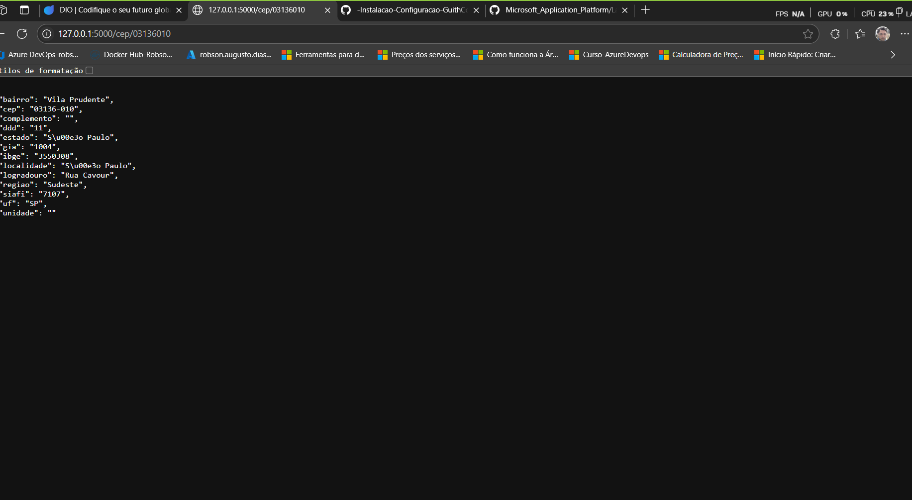

# -Instalacao-Configuracao-GuithCopilot-

Criação de APIs RESTful: Aprendeu a estruturar rotas, lidar com métodos HTTP e retornar respostas em JSON, facilitando a integração com outros sistemas.
Consumo de APIs externas: Utilizou a biblioteca requests para buscar dados em serviços externos (como o ViaCEP), mostrando como integrar diferentes fontes de dados.
Testes automatizados: Viu como criar testes automatizados com pytest e unittest.mock, garantindo que sua aplicação funcione corretamente e facilitando a manutenção.
Tratamento de erros: Implementou respostas apropriadas para diferentes cenários (sucesso e erro), melhorando a experiência do usuário e a robustez da aplicação.
Boas práticas de organização: Separou código de aplicação e testes, usou fixtures do pytest e configurou o ambiente de desenvolvimento para facilitar testes e depuração.
Possibilidades de expansão: Pode evoluir a API para incluir autenticação, cache de respostas, documentação automática (Swagger), deploy em nuvem (como Azure ou AWS), entre outros.
Esses aprendizados são fundamentais para o desenvolvimento de aplicações web modernas, escaláveis e seguras.

